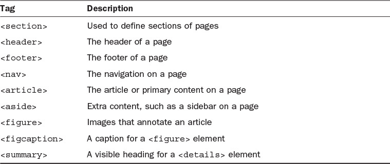
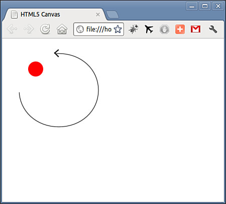
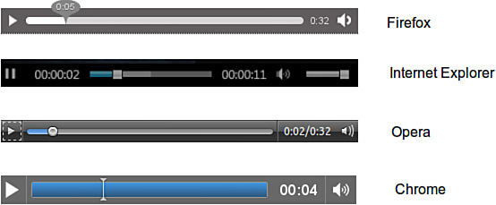

# Hour 11
# JavaScript and HTML5
>  ### What You’ll Learn in This Hour:
> * About the new HTML5 markup tags
> * How to handle video and audio
> * Using the `<canvas>` element

The previous version of HTML, HTML 4.01, has been around
since 1999.

The XML-based version of HTML, XHTML, had been the subject
of various recent W3C efforts, the latest having been moves
toward XHTML2. In 2009 the W3C announced that XHTML2 was to
be dumped in favor of diverting resources to a new version
of HTML, HTML5.

This latest incarnation of HTML concentrates on developing
HTML as a front end for web applications, extending the
markup language via semantically rich elements,
introducing some new attributes, and adding the
possibility to use brand-new APIs in conjunction with
JavaScript.

The HTML5 standard was finalized as the new standard for
HTML in the fall of 2014, and the major browsers already
support many of the new HTML5 elements and APIs.

In this hour, you learn how to control some of these
powerful new features with JavaScript.

### Tip
> Note how it’s written: HTML5. There’s no space between the L and the 5.


### New Markup for HTML5
Even HTML pages that are well-formed are more difficult to read
and interpret than they could be, because the markup contains
very little semantic information.

Page sections such as sidebars, headers and footers, and
navigation elements are all contained in general-purpose page
elements such as divs, and only identifiable by the ID and
class names invented by the page’s developer.

HTML5 adds new elements to more easily identify each of these,
and more, types of content. Some of the new tags are listed in
Table 11.1.


TABLE 11.1 Some New HTML5 Tags

### Some Important New Elements
While HTML5 introduces a wide variety of interesting new
capabilities, this section concentrates on the new tags that
help ease some long-standing difficulties.

#### Video Playback with `<video>`
Video on the Web is extremely popular. However, the methods for
implementing video are generally proprietary, reproduction
happening via plug-ins such as Flash, Windows Media, and Apple
QuickTime. Markup that works for embedding these elements in
one browser doesn’t always work in the others.

HTML5 contains a new `<video>` element, the aim of which is to
enable the embedding of any and all video formats.

Using the new `<video>` tag, you can implement your favorite
QuickTime movie like this:

`<video src="video.mov" />`

So far there has been much debate about which video formats
(codecs) should be supported by the video element; at the time
of writing, the search continues for a codec that requires no
special licensing terms, though WebM

(http://www.webmproject.org/) is currently looking like the
favorite. For the time being, quoting multiple sources gets
around the problem and avoids the need for browser
sniffing; there are currently three widely supported video
formats—MP4, WebM, and Ogg.

```JavaScript
<video id="vid1" width="400" height="300" controls="controls">
    <source src="movie.mp4" type="video/mp4" />
    <source src="movie.ogg" type="video/ogg" />
    <source src="movie.webm" type="video/webm" />
    <p>Video tag not supported.</p>
</video>
```
It is also a good practice to include width and height attributes
for the `<video>` element. If height and width are not set, the
browser doesn’t know how much screen space to reserve,
resulting in the page layout changing as the video loads.

You are also recommended to place some suitable text between the
`<video>` and `</video>` tags to display in browsers that don’t
support the `<video>` tag.

Some important properties of the `<video>` tag are listed in
Table 11.2.


TABLE 11.2 Some Attributes of the `<video>` Element

Note that the appearance of the controls added using the controls
property will depend on the browser in use, as shown in Figure
11.1.


FIGURE 11.1 The appearance of controls varies between browsers

You can access these properties in the same way as any other
JavaScript or DOM object. For the previous video definition, you
might use

```JavaScript
var myVideo = document.getElementById("vid1").volume += 0.1;

to marginally increase the volume, or

if(document.getElementById("vid1").paused) {
    alert(message);
}
```
to pass a message to the user indicating that video playback is
currently paused.

Testing Format Support with canPlayType()
You can check for support for a particular codec using the
JavaScript method

`media.canPlayType(type)`

In the preceding example, type is a string containing the media
type, for example, “video/webm”. This method must return an empty string if
the browser knows it cannot play the content. The method might also return
“probably” if the browser is confident it can support the format, or “maybe”
otherwise.

#### Controlling Playback
Playback can also be controlled programmatically using the pause() and play()
commands, as in the following code snippet:
```JavaScript
var myVideo = document.getElementById("vid1").play();
var myVideo = document.getElementById("vid1").pause();
```
#### Playing Sound with the <audio> Tag
Pretty much everything stated previously about the <video> tag applies equally
well to the <audio> tag. The simple way to use the <audio> tag is like this:

`<audio src="song.mp3"></audio>`

You can add further attributes to achieve more control over playback, such as
loop and autoplay:

`<audio src="song.mp3" autoplay loop></audio>`

### Tip

> Don’t abuse loop and autoplay, or you may find that many of your site visitors don’t return!

As with the earlier examples for video files, you can include alternative
formats to help ensure that a user’s browser will find one that it can play, as
in the following code:
```JavaScript

<audio controls="controls">
    <source src="song.ogg" type="audio/ogg" />
    <source src="song.mp3" type="audio/mpeg" />
    Your browser does not support the audio element.
</audio>

```
MP3, WAV, and Ogg are typically supported file formats for the <audio> element. Controlling an audio file in JavaScript uses the same methods as for the <video> tag.

To add and play an audio file via JavaScript, you can treat it just like any other JavaScript or DOM object:

var soundElement = document.createElement('audio');
soundElement.setAttribute('src', 'sound.ogg');
soundElement.play();
soundElement.pause();

The <audio> and <video> tags have many useful properties that you can access via JavaScript. Here are a few useful ones, the meaning of which will be immediately apparent:

mediaElement.duration
mediaElement.currentTime
mediaElement.playbackRate
mediaElement.muted

For example, to move to a point 45 seconds into a song you might use

soundElement.currentTime = 45;

Tip

You can find a comprehensive reference to these tags and their properties and methods at
http://www.whatwg.org/specs/web-apps/current-work/multipage/the-video-element.html.

Drawing on the Page with <canvas>
The new <canvas> tag gives you just that: a rectangular space in your page where you can draw shapes and graphics, as well as load and display image files and control their display via JavaScript. The many practical uses for the element include dynamic charts, JavaScript/HTML games, and instructional animations.

Using the <canvas> tag simply allows you to define a region by setting its width and height parameters; everything else related to creating the graphical content is done via JavaScript. There is an extensive set of drawing methods known as the Canvas 2D API.

Drag and Drop
Drag and drop is a part of the HTML5 standard. Just about any element can be made draggable.

To make an element draggable, all that’s required is to set its draggable attribute to true:


Dragging something, though, isn’t much use by itself. To employ a draggable object to achieve something useful, you’re probably going to want to be able to drop it somewhere.

To define where an object can be dropped, and control the dragging and dropping process, you need to write event listeners to detect and control the various parts of the drag-and-drop process.

There are a few different events you can utilize to control your drag and drop:

dragstart
drag
dragenter
dragleave
dragover
drop
dragend
Tip

Not all items can be drop targets—an , for example, cannot accept drops.

To control your drag and drop, you need to define a source element (where the drag starts), the data payload (what it is you’re dragging), and a drop target (an area to catch the dropped item).

The dataTransfer property contains a piece of data sent in a drag action. The value of dataTransfer is usually set in the dragstart event and read/handled in the drop event.

Calling setData(format, data) or getData(format, data) will (respectively) set or read this piece of data.

Local Storage
HTML5 pages can store even large amounts of data within the user’s browser, without any negative effect on the website’s performance. Web storage is more secure and faster than doing this via cookies. Like when using cookies, the data is stored in key/value pairs, and a web page can only access the data it has itself stored.

The two new objects for storing data locally in the browser are

localStorage—Stores data with no expiration date
sessionStorage—Stores data just for the current session
If you’re unsure about your browser’s support for local storage, once again you can use feature detection:

if(typeof(Storage)!=="undefined") {
    ... both objects are available ...
}

To store a value you can invoke the setItem method, passing to it a key and a value:

localStorage.setItem("key", "value");

Alternatively, you can use the localStorage object like an associative array:

localStorage["key"] = "value";

Retrieving the values can use either of these methods too:

alert(localStorage.getItem("key"));

or

alert(localStorage["key"]);

Working with Local Files
At last HTML provides a standard way to interact with the user’s local files, using HTML5’s File API specification. There are several ways to access external files:

File provides information including name, size, and MIME type, and gives a reference to the file handle.
FileList is an array-like sequence of File objects.
The FileReader interface uses File and FileList to asynchronously read a file. You can check on read progress, catch any errors, and find out when a file is completely loaded.
Checking for Browser Support
Once more, you can check whether your browser supports the File API by the usual feature-detection method:

if (window.File && window.FileReader && window.FileList) {
    // we're good
}

Summary
HTML5 offers a whole array of new facilities to HTML, enabling the markup language to be used as a much better basis for web applications and allowing JavaScript to exploit some brand-new APIs.

In this hour, you had a whistle-stop tour of these new capabilities, including some hands-on coding experience using some of these new APIs.

Q&A
Q. What is the best way for me to learn HTML5?

A. Learn HTML5 by using it. Jump right in and start building pages using HTML5 features. Use the semantic tags; try video and audio playback; play with drag and drop, and the file API; and build animations using <canvas>. When you have questions, many Internet-based tutorials, blogs, and code examples are available.

Q. Are there already real live sites using HTML5?

A. Sure, lots of them. Take a look at http://html5gallery.com/ for some examples.

Exercises
Review some of the examples of previous hours, and try to rewrite them using some of the new HTML5 interfaces.
HTML5 is pretty new at the time of writing. Check out the current state of browser support for the various aspects of HTML5 at http://caniuse.com/ or http://html5readiness.com/.
